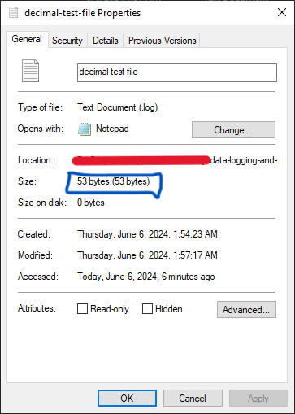
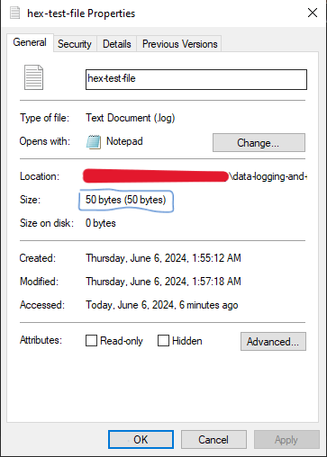
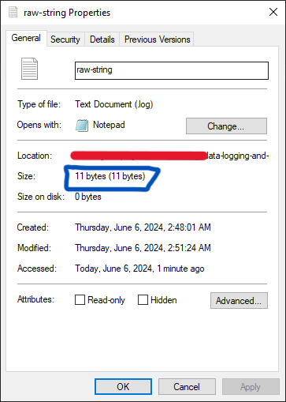

# N4-Recovery
RND for N4 recovery team

## N4 Flight Software Documentation

### N4 Flight software requirements 

---

#### 1. Rocket kinematics (acceleration, velocity)

a) Perform accurate calculation of acceleration and velocity from sensor data

b) Perform data filtering to get close to ideal simulated data

#### 2. Rocket altitude above ground level (AGL)

a) Determine the rocket's instantaneous AGL during flight

#### 3. Flight state transitions 

a) Accurately switch to the corresponding flight state based on evaluated sensor data 

#### 4. Data logging and storage 

a) Collect and aggregate all sensor data and store it in an external flash memory for post-flight data recovery

b) Perform onboard system logging to indicate all events that occur during flight and store this in a separate system log file

#### 5. Onboard systems diagnostics 

a) Troubleshoot onboard subsystems such as the sensors, batteries etc. and log to the system file 

b) Package the system diagnostics results into telemetry packets for transmission to ground

#### 6. GPS location 

a)  Accurately determine the latitude, longitude and timestamp of the rocket using GPS for post flight recovery

#### 7. Rocket attitude (orientation ) determination

a) Calculate the roll and pitch of the rocket in space during flight 

#### 8. Command and data handling 

a) Receive commands sent from ground station

b) Decode commands sent from ground station

c) Acknowledge and perform command sent from the ground station

#### 9. Telemetry transmission

a) Reliably transmit the rocket's data to the ground station 

b) Perform error detection and correction on the telemetry packets 

#### 10. Video capture and streaming**

a) Capture video stream during flight

b) Record video stream to an onboard SD card for post-flight analysis

b) Transmit video stream to ground**


### Tasks and task creation

---

### 

### Data queues and task communication

---


### Telemetry and transmission to ground

----

#### Link budget calculation


### Data Logging and storage 

---

For logging and storage, we use two methods to ensure redundancy.

One is logging to an external SPI flash memory during flight, the WINBOND W25Q32JVSIQ2135, which is a 32Mbits(4 MB) storage chip. 
For redundancy, we add a microSD card into which data is dumped from the external SPI flash memory POST-FLIGHT.

The logging flowchart is shown below:


#### Flash chip hardware tests 

Using this library [SerialFlashLib](https://github.com/PaulStoffregen/SerialFlash/tree/master), we carried out flash chip hardware tests to make sure the MCU communicates as desired with the memory chip. The circuit diagram is shown below:


The following snapshot from serial monitor shows that ESP32 was able to recognize the chip over the SPI channel.


However, there is a discrepancy when we use this library to recognize this memory chip. This may be because the chip is a fake and therefore not recognized by this library. By default, the lib shows the size of the chip as 1MB, which is wrong. 

If we use the [SparkFun_SPI_SerialFlashChip library](https://github.com/sparkfun/SparkFun_SPI_SerialFlash_Arduino_Library/tree/main), we are able to recognize the chip as shown below.


The flash chip is working okay from the tests above. 

Now, since we want to access the flash memory in a file-system kind of way, where we can read and write FILES, we use the SerialFlash Lib, even if the flash memory is not recognized by it. This will make it easier for us to access huge blocks of memory in chunks and avoid accessing the memory directly. In addition, we can erase files and use SD-like methods to access data.

The demonstration below received data from the serial monitor, and writes it to a file inside the flash memory. 

First we test for file R/W. 

##### Known issue
When using SPI protocol on breadboard, it might fail to communicate with the peripheral device. This is because SPI is high-speed and is expected to be used with short traces on PCB. When testing this part, I experienced errors before i realized this issue. To correct this, i reduced the SPI communication speed from 50MHz to 20MHz so that I could access the R/W functions using the breadboard. More details are in reference #8 below. 


The image below shows the response after I reduced the SPI speed: 


Testing method
1. I created a file 4KB in size and named it ```test.csv```. 
2. Then generated dummy data using random() functions in Arduino. 
3. I then appended this random data to the file, while checking the size being occupied by the file
4. 


#### Encoding and space optimizations 

---

The aim of this optimization is to ensure we have as much memory as possible to store the flight data. To do this, we need to test how much in-memory space various data formats will take. This is explained below

#### Encoding and storing integers and floats

To carry out this comparison, I created two files. One with purely integer values and the other with the same integer values but in HEX format.

```
// decimal-test-file.log
2245454
2245454
2245454
34
34
34
34
34
34
34

```

```
// hex-test-file.log
22434E
22434E
22434E
22
22
22
22
22
22
22

```

Saving and checking the properties of the two files in Windows platform shows the following: 

For the decimal file, the size is 53 bytes



For the hexadecimal file, the size is 50 bytes



The hexadecimal file is 3 bytes smaller as observed. 

#### Encoding and storing strings

For strings, since we are not going to use any non-ASCII characters, we can store the string as is. This means that if we have a string like "flight data", it would take 12 bytes, since one char is 1 byte. In addition, the string metadata like length and nul terminator take some few extra bytes. 

If we could encode this string into hex, using UTF-8 encoding scheme, it would take the same 12 bytes. 
This test is carried out below to justify why we store the strings as is without encoding them. 

I wrote a program to convert a string to HEX format, and compared the following string:

```
flight data
```

In HEX format, it produces the following:

```
666C696768742064617461
```

Raw string size (Windows platform)



Hex string size 


The raw string occupies 11 bytes, while the same strinf in HEX format occupies a whooping 24 bytes! This is not feasible considering we will be storing several strings in a 4 MB limited flash memory over the flight time, which will certainly occupy lots of memory if we store HEX strings.


### State machine logic and operation

---

#### States

#### State transition conditions 

#### State functions handling 

### IMU

#### Calculating acceleration from accelerometer


#### Calculating velocity from accelerometer
The initial idea is to use integration. 
Since velocity is the first integral of acceleration. From the equation: 
``` v = u + at ```

So what we do to calculate the velocity is keep track of time, acceleration in the requires axis and then update the initial velocity. Consider the X axis: 

``` Vx = Ux + ACCx*Sample_time ```  
``` Ux = Vx  ```

(Let the sample tme be 1ms (0.001 s))

Known issue is velocity drift: where the velocity does not get to zero even when the sensor is stationary. small errors in the measurement of acceleration and angular velocity are integrated into progressively larger errors in velocity, which are compounded into still greater errors in position

Article: [IMU Velocity drift](https://en.wikipedia.org/wiki/Inertial_navigation_system#Drift_rate)

However, after extensive research online, it was concluded that getting velocity from accelerometer is very innacurate and unreliable. Check out this reddit thread:
[Acceleration & velocity with MPU6050](https://www.reddit.com/r/embedded/comments/138jnhu/acceleration_velocity_with_mpu6050/)

Check this arduinoForum article too (ArduinForum)
[https://forum.arduino.cc/t/integrating-acceleration-to-get-velocity/954731/8]

Following this, we decide to keep the accelerometer for measuring the acceleration and the rocket orientation.

### Data Filtering 

---

#### Complementary filter 

### Utility scripts
During development the following scripts might (and will) be useful.

##### 1. HEX converter
Converts string to HEX string and back. Built with python
###### Requirements
1. Python > 3.10

The screenshot below shows the program running:


###### Usage 
Open a terminal window in the folder containing the ```hex-converter.py``` file and run the following command:

```c
python hex-converter.py
```
The screenshot above appears. Select your option and proceed. The program will output your string in HEX format.


### References and Error fixes

1. (Wire LIbrary Device Lock) [Confusing overload of `Wire::begin` · Issue #6616 · espressif/arduino-esp32 · GitHub](https://github.com/espressif/arduino-esp32/issues/6616)
2. (Estimating velocity and altitude) [https://www.ncbi.nlm.nih.gov/pmc/articles/PMC4179067/]
3. [rocket orientation and velocity] (https://www.reddit.com/r/rocketry/comments/10q7j8m/using_accelerometers_for_rocket_attitude/)
4. https://cdn.shopify.com/s/files/1/1014/5789/files/Standard-ASCII-Table_large.jpg?10669400161723642407
5. https://www.codeproject.com/Articles/99547/Hex-strings-to-raw-data-and-back
6. https://cdn.shopify.com/s/files/1/1014/5789/files/Standard-ASCII-Table_large.jpg?10669400161723642407
7. https://www.geeksforgeeks.org/convert-a-string-to-hexadecimal-ascii-values/
8. (SPI Flash memory file creation issue on breadboard) https://forum.arduino.cc/t/esp32-and-winbond-w25q128jv-serial-flash-memory/861315/3


