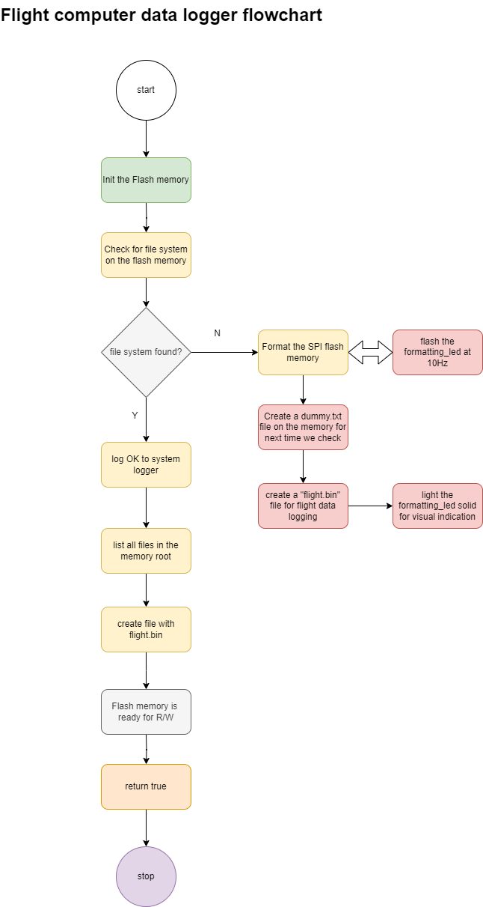
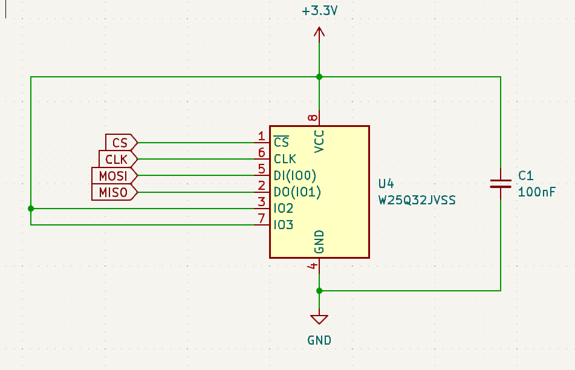
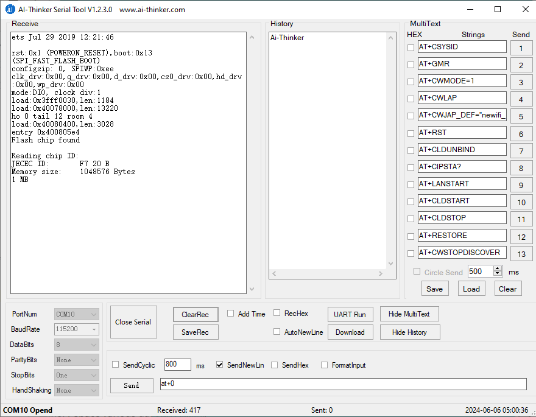
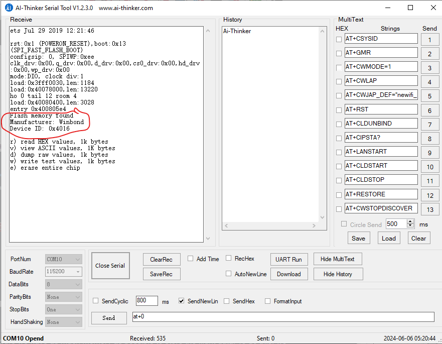
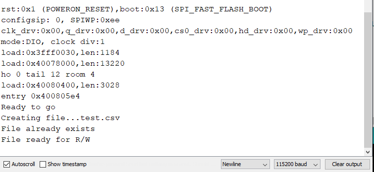
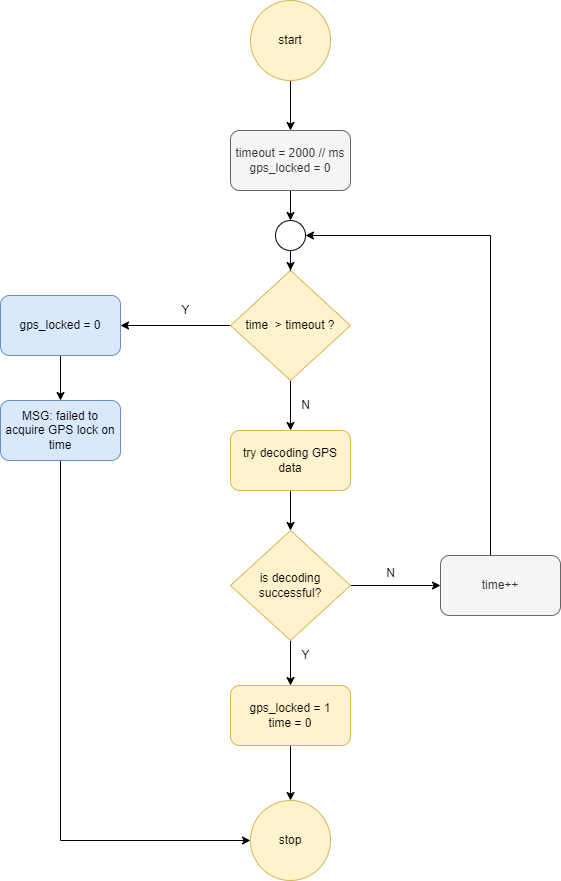
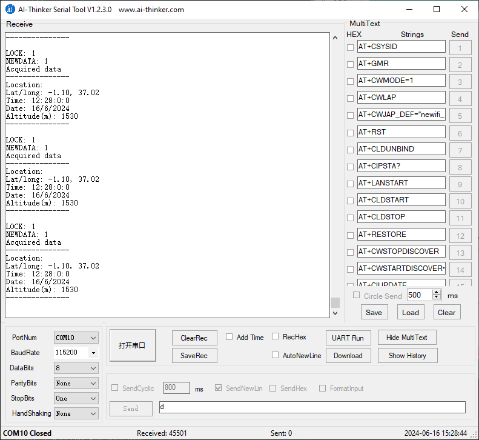
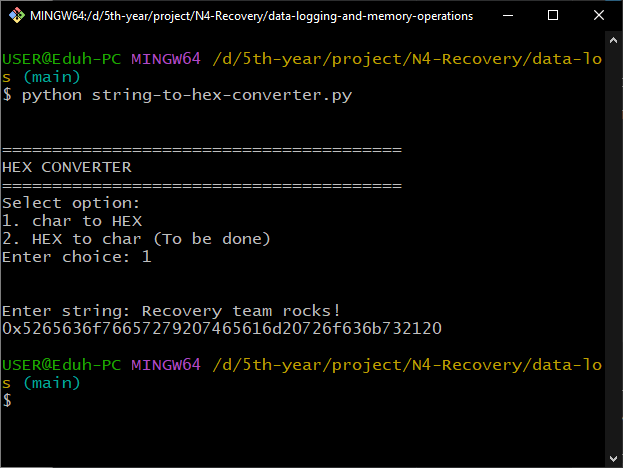

# N4-Recovery
RND for N4 recovery team

## N4 Flight Software Documentation

### N4 Flight software requirements 

---

#### 1. Rocket kinematics (acceleration, velocity)

a) Perform accurate calculation of acceleration and velocity from sensor data

b) Perform data filtering to get close to ideal simulated data

#### 2. Rocket altitude above ground level (AGL)

a) Determine the rocket's instantaneous AGL during flight

#### 3. Flight state transitions 

a) Accurately switch to the corresponding flight state based on evaluated sensor data 

#### 4. Data logging and storage 

a) Collect and aggregate all sensor data and store it in an external flash memory for post-flight data recovery

b) Perform onboard system logging to indicate all events that occur during flight and store this in a separate system log file

#### 5. Onboard systems diagnostics 

a) Troubleshoot onboard subsystems such as the sensors, batteries etc. and log to the system file 

b) Package the system diagnostics results into telemetry packets for transmission to ground

#### 6. GPS location 

a)  Accurately determine the latitude, longitude and timestamp of the rocket using GPS for post flight recovery

#### 7. Rocket attitude (orientation ) determination

a) Calculate the roll and pitch of the rocket in space during flight 

#### 8. Command and data handling 

a) Receive commands sent from ground station

b) Decode commands sent from ground station

c) Acknowledge and perform command sent from the ground station

#### 9. Telemetry transmission

a) Reliably transmit the rocket's data to the ground station 

b) Perform error detection and correction on the telemetry packets 

#### 10. Video capture and streaming**

a) Capture video stream during flight

b) Record video stream to an onboard SD card for post-flight analysis

b) Transmit video stream to ground**


### Tasks and task creation

---

### 

### Data queues and task communication

---


### Telemetry and transmission to ground

----

#### Link budget calculation


#### Telemetry packet structure

| Data                  | Data type | Size (bytes) | Description                                              |
| --------------------- | --------- | ------------ | -------------------------------------------------------- |
| record_number         | uint32_t  | 4            | record number count                                      |
| state                 | uint8_t   | 1            | current flight state                                     |
| operation_mode        | uint8_t   | 1            | current flight mode, whether SAFE or ARMED               |
| ax                    | float     | 4            | acceleration in the x-axis (m/s^2)                       |
| ay                    | float     | 4            | acceleration in the y-axis (m/s^2)                       |
| az                    | float     | 4            | acceleration in the z-axis (m/s^2)                       |
| pitch                 | float     | 4            | pitch angle (deg)                                        |
| roll                  | float     | 4            | roll angle (deg)                                         |
| gx                    | float     | 4            | angular velocity along the x-axis (deg/sec)              |
| gy                    | float     | 4            | angular velocity along the y-axis (deg/sec)              |
| gz                    | float     | 4            | angular velocity along the z-axis (deg/sec)              |
| latitude              | double    | 8            | geographical distance N or S of equator (deg)            |
| longitude             | double    | 8            | geographical distance E or W of Greenwich Meridian (deg) |
| gps_altitude          | uint16_t  | 2            | altitude read by the onboard GPS (m)                     |
| gps_time              | time_t    | 4            | current time from the GPS (UTC)                          |
| pressure              | float     | 4            | pressure from the altimeter (mb)                         |
| temperature           | uint8_t   | 1            | temperature from the altimeter (deg C)                   |
| altitude_agl          | uint16_t  | 2            | height above ground level                                |
| velocity              | float     | 4            | velocity derived from the altimeter                      |
| pyro1_state           | uint8_t   | 1            | state of main chute pyro (whether ejected or active)     |
| pyro2_state           | uint8_t   | 1            | state of drogue chute pyro (whether ejected or active)   |
| battery_voltage       | uint8_t   | 1            | voltage of the battery during flight                     |
|                       |           |              |                                                          |
| **Total packet size** |           | **74 BYTES** |                                                          |


### Data Logging and storage 

---

For logging and storage, we use two methods to ensure redundancy.

One is logging to an external SPI flash memory during flight, the WINBOND W25Q32JVSIQ2135, which is a 32Mbits(4 MB) storage chip. 
For redundancy, we add a microSD card into which data is dumped from the external SPI flash memory POST-FLIGHT.

The logging flowchart is shown below:




#### Flash chip hardware tests 

Using this library [SerialFlashLib](https://github.com/PaulStoffregen/SerialFlash/tree/master), we carried out flash chip hardware tests to make sure the MCU communicates as desired with the memory chip. The circuit diagram is shown below:




#### PCB layout for the flash memory

To ensure maximum reliability of the flash memory on the PCB, follow the following techniques during layout:


The following snapshot from serial monitor shows that ESP32 was able to recognize the chip over the SPI channel.



However, there is a discrepancy when we use this library to recognize this memory chip. This may be because the chip is a fake and therefore not recognized by this library. By default, the lib shows the size of the chip as 1MB, which is wrong. 

If we use the [SparkFun_SPI_SerialFlashChip library](https://github.com/sparkfun/SparkFun_SPI_SerialFlash_Arduino_Library/tree/main), we are able to recognize the chip as shown below.



The flash chip is working okay from the tests above. 

Now, since we want to access the flash memory in a file-system kind of way, where we can read and write FILES, we use the [SerialFlash Library](https://github.com/PaulStoffregen/SerialFlash), even if the flash memory is not recognized by it. This will make it easier for us to access huge blocks of memory in chunks and avoid accessing the memory directly. In addition, we can erase files and use SD-like methods to access data.

The demonstration below received data from the serial monitor, and writes it to a file inside the flash memory. 

First we test for file R/W. 

##### Known issue 

When using SPI protocol on breadboard, it might fail to communicate with the peripheral device. This is because SPI is high-speed and is expected to be used with short traces on PCB. When testing this part, I experienced errors before i realized this issue. To correct this, I reduced the SPI communication speed from 50MHz to 20MHz so that I could access the R/W functions using the breadboard. More details are in reference #8 below. 

Note: Make sure you change the speed to 20MHz for your files to be created. Change the speed in the SerialFlashChip.cpp near the top of the file (SPICONFIG)


The image below shows the response after I reduced the SPI speed: 


Testing method
1. I created a file 4KB in size and named it ```test.csv```. 
2. Then generated dummy data using random() functions in Arduino. 
3. I then appended this random data to the file, while checking the size being occupied by the file
4. Running the ```flash_read.ino``` file after data is done recording displays all the recorded data on the flash memory


#### How to recover the data 

Use ```Nakuja Flight Data Recovery Tool``` to dump the recorded data as follows: 


### GPS Operations 

GPS is used to give us accurate location in terms of longitude, latitude, time and altitude. This data is useful for post-flight recovery and for apogee detection and verification. However, because of the low sample rate of GPS modules (1 Hz), we cannot use it reliably to log altitude data since rocketry is high speed. 


#### Reading GPS data algorithm 

We read GPS data using the [TinyGPSPlus Library](https://github.com/mikalhart/TinyGPSPlus). The data of interest is the latitude, longitude, time and altitude. The algorithm is as follows:

1. Create GPS data queue
2. Create the ```readGPS``` task
3. Inside the task, create a local ```gps_type_t``` variable to hold the sampled data
4. Read the latitude, longitude, time and altitude into the ```gps_type_t``` variable
5. Send this data to ```telemetry_queue```

#### GPS  fix time issues

The start of GPS can be cold or warm. Cold start means the GPS is starting from scratch, no prior satellite data exists, and here it takes much time to lock satellites and download satellite data. Once you initially download satellite data, the following connections take less time, referred to as warm-starts.

When using GPS, you will find that the time it takes to acquire a fix to GPS satellites depends on the cloud cover. If the cloud cover is too high, it takes longer to acquire a signal and vice-versa. During one of the tests of the GPS, it took ~2 min at 45% cloud cover to acquire signal. 

During launch, we do not want to wait for infinity to get a GPS lock, so we implement a timeout as follows:

```c
Consider the GPS_WAIT_TIME as 2 minutes (2000ms):

1. Initialize a timeout variable and a lock_acquired boolean value
2. Check the value of the timeout_variable
3. Is it less than the GPS_WAIT_TIME?
4. If less than the wait time,  continue waiting for GPS fix, if more than the GPS_WAIT_TIME, stop waiting for fix and return false
5. If the GPS data is available and successfully encoded via serial, set the lock_acquired booelan value to true
```

This timeout will ensure we do not delay other sub-systems of the flight software from starting.

##### Flowchart 




#### GPS tests

The following screenshots show the results of GPS tests during development. In the image below, the raw GPS coordinates are read and printed on the serial debugger:




### State machine logic and operation

---

#### States

#### State transition conditions 

#### State functions handling 

### IMU

#### Calculating acceleration from accelerometer


#### Calculating velocity from accelerometer
The initial idea is to use integration. 
Since velocity is the first integral of acceleration. From the equation: 
``` v = u + at ```

So what we do to calculate the velocity is keep track of time, acceleration in the requires axis and then update the initial velocity. Consider the X axis: 

``` Vx = Ux + ACCx*Sample_time ```  
``` Ux = Vx  ```

(Let the sample tme be 1ms (0.001 s))

Known issue is velocity drift: where the velocity does not get to zero even when the sensor is stationary. small errors in the measurement of acceleration and angular velocity are integrated into progressively larger errors in velocity, which are compounded into still greater errors in position

Article: [IMU Velocity drift](https://en.wikipedia.org/wiki/Inertial_navigation_system#Drift_rate)

However, after extensive research online, it was concluded that getting velocity from accelerometer is very innacurate and unreliable. Check out this reddit thread:
[Acceleration & velocity with MPU6050](https://www.reddit.com/r/embedded/comments/138jnhu/acceleration_velocity_with_mpu6050/)

Check this arduinoForum article too (ArduinForum)
[https://forum.arduino.cc/t/integrating-acceleration-to-get-velocity/954731/8]

Following this, we decide to keep the accelerometer for measuring the acceleration and the rocket orientation.

### Data Filtering 

---

#### Complementary filter 

### Utility scripts
During development the following scripts might (and will) be useful.

##### 1. HEX converter
Converts string to HEX string and back. Built with python
###### Requirements
1. Python > 3.10

The screenshot below shows the program running:


###### Usage 
Open a terminal window in the folder containing the ```hex-converter.py``` file and run the following command:

```c
python hex-converter.py
```
The screenshot above appears. Select your option and proceed. The program will output your string in HEX format.


### References and Error fixes

1. (Wire LIbrary Device Lock) [Confusing overload of `Wire::begin` · Issue #6616 · espressif/arduino-esp32 · GitHub](https://github.com/espressif/arduino-esp32/issues/6616)
2. (Estimating velocity and altitude) [https://www.ncbi.nlm.nih.gov/pmc/articles/PMC4179067/]
3. [rocket orientation and velocity] (https://www.reddit.com/r/rocketry/comments/10q7j8m/using_accelerometers_for_rocket_attitude/)
4. https://cdn.shopify.com/s/files/1/1014/5789/files/Standard-ASCII-Table_large.jpg?10669400161723642407
5. https://www.codeproject.com/Articles/99547/Hex-strings-to-raw-data-and-back
6. https://cdn.shopify.com/s/files/1/1014/5789/files/Standard-ASCII-Table_large.jpg?10669400161723642407
7. https://www.geeksforgeeks.org/convert-a-string-to-hexadecimal-ascii-values/
8. (SPI Flash memory file creation issue on breadboard) https://forum.arduino.cc/t/esp32-and-winbond-w25q128jv-serial-flash-memory/861315/3


