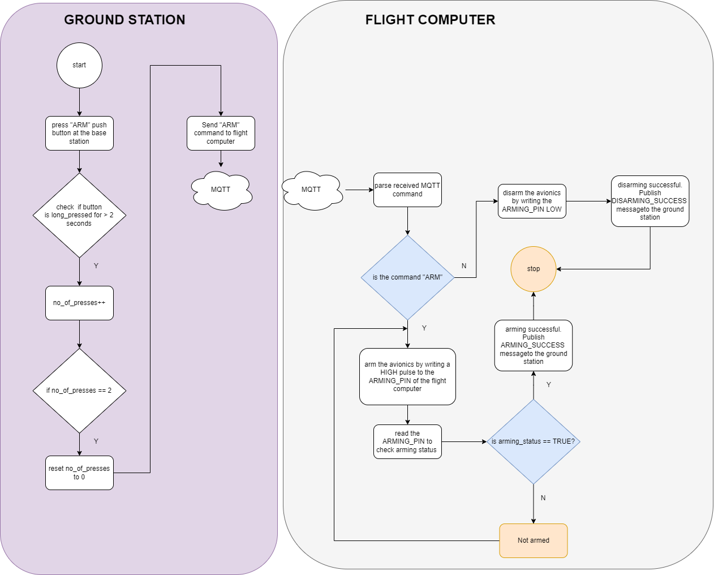
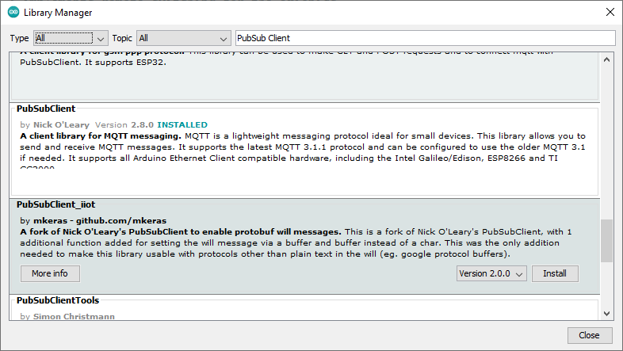
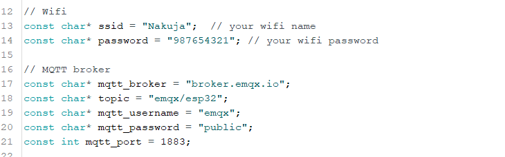

## Remote switching 
---
### Introduction
This folder contains code for remote switching using MQTT and using XBee HP 900MHz modules. Remote switching will enable remote arming of the avionics when and only when they are safely secure on the launch pad, so that any misfires are avoided and safety of the launch crew is guaranteed. 

### Flowchart 



### With MQTT
To perform remote switching with MQTT. The following procedure is used. This assumes you are using an ESP32 board. 

#### Install PubSubClient
We will install the MQTT client library PubSubClient. Developed by Nick O'Leary, PubSubClient is a lightweight MQTT client library designed for Arduino-based projects. It provides a client for simple publish/subscribe messaging with a server supporting MQTT. This library simplifies MQTT communication and enables efficient data exchange in Arduino-based IoT applications.

To install the PubSubClient library, please follow these steps:

1. Open the Arduino IDE, then go to "Project" in the menu bar.
2. Select "Load library" and then choose "Library manager".
3. In the Library Manager, type "PubSubClient" into the search bar.
Locate the "PubSubClient" library by Nick O'Leary and click the "Install" button.

By following these steps, you will successfully install the PubSubClient library into your Arduino IDE.



#### Uploading the code
1. Open the ```remote-switching-mqtt``` folder and locate the ```remote-switching-mqtt``` sketch. 
2. Open the ```defs.h```, and change the credentials in the ```defs.h```. Namely wifi_ssid, wifi_password, and MQTT credentials you are using, namely MQTT_BROKER, topic, mqtt_username, mqtt_password, and mqtt_port. Change them accordingly. Foe instance the mqtt broker will be the IP_ADDRESS of the machine running the MQTT broker.



2. Connect your ESP32 board and upload the code. 


